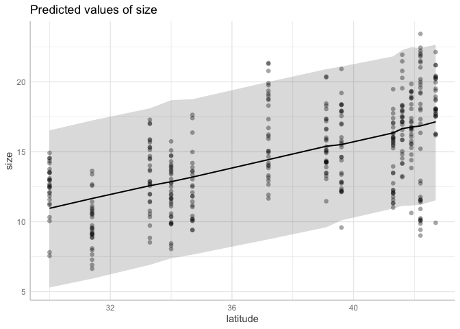
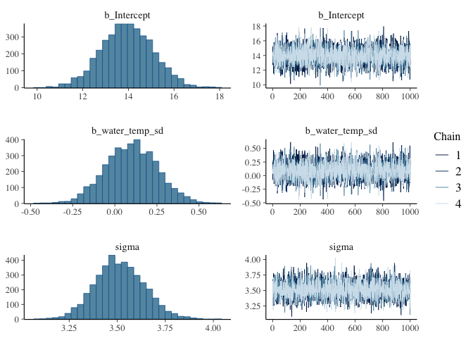

Activity 9: Statistical reasoning 1: intro to models
================

------------------------------------------------------------------------

You will submit two outputs for this activity:

1.  A **PDF** of a rendered Quarto document with all of your R code.
    Please create a new Quarto document (e.g. don’t use this
    `README.qmd`), include all of the code that appears in this
    document, in addition to adding your own code and **answers to all
    of the questions** in the “Q#” sections. Submit this through
    Gradescope.

2.  A plot and your answers from the final section. Submit that content
    to the google slide below:
    <https://docs.google.com/presentation/d/1AJVu0eq5-OoRGi4UlBervrqKbFHOINvAB-8u0JaFzYM/edit?usp=sharing>

*If you have trouble submitting as a PDF, please ask Calvin or Malin for
help. If we still can’t solve it, you can submit the .qmd file instead.*

A reminder: **Please label the code** in your final submission in two
ways: 1) denote your answers to each question using headers that
correspond to the question you’re answering and 2) thoroughly “comment”
your code: remember, this means annotating your code directly by typing
descriptions of what each line does after a `#`. This will help future
you!

------------------------------------------------------------------------

Let’s start by reading in the relevant packages

``` r
library(brms) # for statistics
library(tidyverse)
library(ggeffects) # for the prediction plot
library(lterdatasampler)
```

------------------------------------------------------------------------

# 1. Fiddler crabs

Fiddler crab picture here

The data today is fiddler crab size data from 13 salt marshes from
Florida to Massachusetts. Crab size was measured as carapace width. Air
and water temperature data from nearby monitoring programs are also
included.

``` r
head(pie_crab)
```

    # A tibble: 6 × 9
      date       latitude site   size air_temp air_temp_sd water_temp water_temp_sd
      <date>        <dbl> <chr> <dbl>    <dbl>       <dbl>      <dbl>         <dbl>
    1 2016-07-24       30 GTM    12.4     21.8        6.39       24.5          6.12
    2 2016-07-24       30 GTM    14.2     21.8        6.39       24.5          6.12
    3 2016-07-24       30 GTM    14.5     21.8        6.39       24.5          6.12
    4 2016-07-24       30 GTM    12.9     21.8        6.39       24.5          6.12
    5 2016-07-24       30 GTM    12.4     21.8        6.39       24.5          6.12
    6 2016-07-24       30 GTM    13.0     21.8        6.39       24.5          6.12
    # ℹ 1 more variable: name <chr>

------------------------------------------------------------------------

## 1.1 Plot data, pick the model

The first step is to graph our data so we can have a visual sense of
what’s going on. Let’s say that our ultimate goal is to understand
whether the size of crabs changes with latitude in a test of Bergmann’s
rule:

> “One of the best-known patterns in biogeography is Bergmann’s rule. It
> predicts that organisms at higher latitudes are larger than ones at
> lower latitudes. Many organisms follow Bergmann’s rule, including
> insects, birds, snakes, marine invertebrates, and terrestrial and
> marine mammals. What drives Bergmann’s rule? Bergmann originally
> hypothesized that the organisms he studied, birds, were larger in the
> colder, higher latitudes due to heat-conservation. But the
> heat-conservation hypothesis relies on internal regulation of body
> temperature and therefore does not apply to ectotherms, some of which
> also follow Bergmann’s rule. There is likely no universal mechanism
> underpinning Bergmann’s rule, regardless of ecto- or endothermy. As a
> result, other mechanisms have been proposed to explain Bergmann’s
> rule, including the starvation-resistant hypothesis, the diet-quality
> hypothesis, the enemy hypothesis, the resource rule, seasonality
> hypothesis, and the temperature–size rule (Johnson et al., 2019).”

To start, let’s plot carapace width (`size`) on the y axis with
`latitude` on the x axis.

``` r
pie_crab %>% 
  ggplot(aes(x = latitude, y = size)) +
  geom_point() +
  # Make the y-axis include 0
  ylim(0, NA)
```


------------------------------------------------------------------------

### Q1.1 Interpret the graph

Interpret this graph: Does it look like size increases with latitude?
Describe how confident you are in this interpretation.

------------------------------------------------------------------------

### Q1.2 Beautify this graph

Make this graph look a bit nicer!

------------------------------------------------------------------------

Now that you’ve spent some time pondering the data, let’s put together
our first model. From lecture, linear models follow the equation:

$y = intercept + slope*x$

Let’s set up our model to look like:

$size = intercept + slope*latitude$

------------------------------------------------------------------------

## 1.2 Fit linear regression with `brms`

------------------------------------------------------------------------

Time to run the model! There’s a lot here: let’s dig in line-by-line.

``` r
# latitude
m.crab.lat <- 
  brm(data = pie_crab, # Give the model the pie_crab data
      # Choose a gaussian (normal) distribution
      family = gaussian,
      # Specify the model here. 
      size ~ latitude,
      # Here's where you specifiy different parameters for executing the Markov chains
      iter = 2000, warmup = 1000, chains = 4, cores = 4,
      # Setting the "seed" sets a given set of random numbers. 
      # In this case, it makes the randomness of the Markov chain runs reproducible 
      # (so that both of us get the exact same results when running the model)
      seed = 4,
      # Save the fitted model object as output - helpful for reloading in the output later
      file = "output/m.crab.lat")
```

### Q1.3 What does the “iter” argument do?

Navigate to the `brm` help page to answer: What does the `iter =`
argument do?

------------------------------------------------------------------------

## 1.3 Assess model

``` r
summary(m.crab.lat)
```

     Family: gaussian 
      Links: mu = identity 
    Formula: size ~ latitude 
       Data: pie_crab (Number of observations: 392) 
      Draws: 4 chains, each with iter = 2000; warmup = 1000; thin = 1;
             total post-warmup draws = 4000

    Regression Coefficients:
              Estimate Est.Error l-95% CI u-95% CI Rhat Bulk_ESS Tail_ESS
    Intercept    -3.61      1.30    -6.09    -1.01 1.00     4116     3192
    latitude      0.48      0.03     0.42     0.55 1.00     4108     3140

    Further Distributional Parameters:
          Estimate Est.Error l-95% CI u-95% CI Rhat Bulk_ESS Tail_ESS
    sigma     2.84      0.10     2.65     3.04 1.00     3758     2852

    Draws were sampled using sampling(NUTS). For each parameter, Bulk_ESS
    and Tail_ESS are effective sample size measures, and Rhat is the potential
    scale reduction factor on split chains (at convergence, Rhat = 1).

``` r
m.crab.lat$fit
```

    Inference for Stan model: anon_model.
    4 chains, each with iter=2000; warmup=1000; thin=1; 
    post-warmup draws per chain=1000, total post-warmup draws=4000.

                   mean se_mean   sd    2.5%     25%     50%     75%   97.5% n_eff
    b_Intercept   -3.61    0.02 1.30   -6.09   -4.51   -3.61   -2.73   -1.01  4177
    b_latitude     0.48    0.00 0.03    0.42    0.46    0.49    0.51    0.55  4170
    sigma          2.84    0.00 0.10    2.65    2.77    2.83    2.90    3.04  3698
    Intercept     14.66    0.00 0.14   14.38   14.56   14.66   14.76   14.93  4365
    lprior        -4.40    0.00 0.02   -4.44   -4.41   -4.39   -4.38   -4.36  3657
    lp__        -968.07    0.02 1.18 -971.06 -968.63 -967.76 -967.20 -966.68  2302
                Rhat
    b_Intercept    1
    b_latitude     1
    sigma          1
    Intercept      1
    lprior         1
    lp__           1

    Samples were drawn using NUTS(diag_e) at Tue Feb  3 14:30:17 2026.
    For each parameter, n_eff is a crude measure of effective sample size,
    and Rhat is the potential scale reduction factor on split chains (at 
    convergence, Rhat=1).

------------------------------------------------------------------------

## 1.4 Interpret model

``` r
plot(m.crab.lat) # show posteriors and chains
```


``` r
summary(m.crab.lat)
```

     Family: gaussian 
      Links: mu = identity 
    Formula: size ~ latitude 
       Data: pie_crab (Number of observations: 392) 
      Draws: 4 chains, each with iter = 2000; warmup = 1000; thin = 1;
             total post-warmup draws = 4000

    Regression Coefficients:
              Estimate Est.Error l-95% CI u-95% CI Rhat Bulk_ESS Tail_ESS
    Intercept    -3.61      1.30    -6.09    -1.01 1.00     4116     3192
    latitude      0.48      0.03     0.42     0.55 1.00     4108     3140

    Further Distributional Parameters:
          Estimate Est.Error l-95% CI u-95% CI Rhat Bulk_ESS Tail_ESS
    sigma     2.84      0.10     2.65     3.04 1.00     3758     2852

    Draws were sampled using sampling(NUTS). For each parameter, Bulk_ESS
    and Tail_ESS are effective sample size measures, and Rhat is the potential
    scale reduction factor on split chains (at convergence, Rhat = 1).

------------------------------------------------------------------------

## 1.5 Plot model on the data

------------------------------------------------------------------------

## 1.6 Repeat with a new variable: water temp sd

Let’s repeat this example with a new variable: the water temperature
standard deviation. The standard deviation (sd) can be used as a metric
of variability: higher sd means higher variability. We can ask: *is
higher variability in water temperature associated with fiddler crab
body size?*

``` r
pie_crab %>% 
  ggplot(aes(x = water_temp_sd, y = size)) +
  geom_point() +
  # Make the y-axis include 0
  ylim(0, NA)
```


### Q1.X Interpret the graph

Does it look like size increases with latitude? Describe how confident
you are in this interpretation.

------------------------------------------------------------------------

We’ll set up our model to look like:

$size = intercept + slope*water_temp_sd$

------------------------------------------------------------------------

### Q1.XX Set up and run this new model

``` r
# water temp sd
m.crab.watersd <- 
  brm(data = pie_crab, 
      family = gaussian,
      size ~ water_temp_sd,
      iter = 2000, warmup = 1000, chains = 4, cores = 4,
      seed = 4,
      file = "output/m.crab.watersd")

plot(m.crab.watersd) # show posteriors and chains
```



``` r
summary(m.crab.watersd)
```

     Family: gaussian 
      Links: mu = identity 
    Formula: size ~ water_temp_sd 
       Data: pie_crab (Number of observations: 392) 
      Draws: 4 chains, each with iter = 2000; warmup = 1000; thin = 1;
             total post-warmup draws = 4000

    Regression Coefficients:
                  Estimate Est.Error l-95% CI u-95% CI Rhat Bulk_ESS Tail_ESS
    Intercept        13.95      1.14    11.69    16.19 1.00     4136     2889
    water_temp_sd     0.10      0.15    -0.20     0.40 1.00     4148     2938

    Further Distributional Parameters:
          Estimate Est.Error l-95% CI u-95% CI Rhat Bulk_ESS Tail_ESS
    sigma     3.51      0.13     3.27     3.77 1.00     4421     2807

    Draws were sampled using sampling(NUTS). For each parameter, Bulk_ESS
    and Tail_ESS are effective sample size measures, and Rhat is the potential
    scale reduction factor on split chains (at convergence, Rhat = 1).

``` r
m.crab.watersd$fit
```

    Inference for Stan model: anon_model.
    4 chains, each with iter=2000; warmup=1000; thin=1; 
    post-warmup draws per chain=1000, total post-warmup draws=4000.

                        mean se_mean   sd     2.5%      25%      50%      75%
    b_Intercept        13.95    0.02 1.14    11.69    13.18    13.94    14.72
    b_water_temp_sd     0.10    0.00 0.15    -0.20    -0.01     0.10     0.20
    sigma               3.51    0.00 0.13     3.27     3.43     3.51     3.60
    Intercept          14.66    0.00 0.18    14.31    14.54    14.66    14.78
    lprior             -4.54    0.00 0.03    -4.61    -4.56    -4.54    -4.52
    lp__            -1051.76    0.03 1.22 -1054.98 -1052.32 -1051.43 -1050.85
                       97.5% n_eff Rhat
    b_Intercept        16.19  4130    1
    b_water_temp_sd     0.40  4135    1
    sigma               3.77  4368    1
    Intercept          15.01  4175    1
    lprior             -4.49  4378    1
    lp__            -1050.38  2105    1

    Samples were drawn using NUTS(diag_e) at Tue Feb  3 14:31:54 2026.
    For each parameter, n_eff is a crude measure of effective sample size,
    and Rhat is the potential scale reduction factor on split chains (at 
    convergence, Rhat=1).

------------------------------------------------------------------------

# 2.

### Q2.10 Export graphs

Export both graphs and both interpretations to this slide deck:
<https://docs.google.com/presentation/d/1AJVu0eq5-OoRGi4UlBervrqKbFHOINvAB-8u0JaFzYM/edit?usp=sharing>

### Render to PDF

And submit the well-labeled PDF on Gradescope. Thanks!

``` r
lterdatasampler::nwt_pikas
```

    # A tibble: 109 × 8
       date       site     station utm_easting utm_northing sex   concentration_pg_g
       <date>     <fct>    <fct>         <dbl>        <dbl> <fct>              <dbl>
     1 2018-06-08 Cable G… Cable …      451373      4432963 male              11563.
     2 2018-06-08 Cable G… Cable …      451411      4432985 male              10629.
     3 2018-06-08 Cable G… Cable …      451462      4432991 male              10924.
     4 2018-06-13 West Kn… West K…      449317      4434093 male              10414.
     5 2018-06-13 West Kn… West K…      449342      4434141 male              13531.
     6 2018-06-13 West Kn… West K…      449323      4434273 <NA>               7799.
     7 2018-06-13 West Kn… West K…      449243      4434156 male               4715.
     8 2018-06-13 West Kn… West K…      449223      4434233 <NA>               2087.
     9 2018-06-13 West Kn… West K…      449244      4434292 male              12899.
    10 2018-06-13 West Kn… West K…      449438      4434201 male              11329.
    # ℹ 99 more rows
    # ℹ 1 more variable: elev_m <dbl>

``` r
nwt_pikas %>% 
  ggplot(aes(x = date, y = concentration_pg_g)) +
  geom_point()
```



m.p.1 \<- brm(data = nwt_pikas, family = gaussian, concentration_pg_g \~
date, iter = 2000, warmup = 1000, chains = 4, cores = 4, seed = 4, file
= “output/m.p.1”)

plot(m.p.1) \# show posteriors and chains summary(m.p.1) m.p.1\$fit

# Elevation model

m.p.elev \<- brm(data = nwt_pikas, family = gaussian, concentration_pg_g
\~ elev_m, iter = 2000, warmup = 1000, chains = 4, cores = 4, seed = 4,
file = “output/m.p.elev”)

plot(m.p.elev) \# show posteriors and chains summary(m.p.elev)
m.p.elev\$fit \`\`\`
